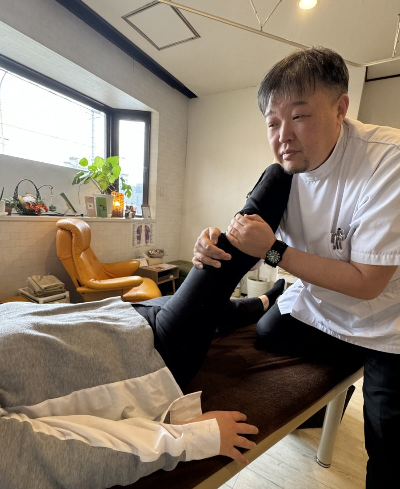

# リーフ治療院 Webサイト 画像差し替えガイド

## 鍼灸の写真を後日差し替える方法

現在、訪問鍼灸の画像はSVGアート(プレースホルダー)になっています。後日、実際の鍼灸施術風景の写真をご用意いただいた際は、以下の手順で差し替えてください。

### 1. 画像の準備

- 推奨サイズ:**横900px × 縦1100px(縦長 4:5)**
- 推奨形式:JPG または WebP
- ファイル名:`service-acupuncture.jpg`(または `.webp`)
- 推奨ファイルサイズ:200KB以下

### 2. 差し替え対象ファイル

下記の2ファイルで鍼灸プレースホルダーが使われています。

#### A. `index.html`(トップページ)
SVG鍼灸イラスト全体を、以下のpictureタグに置き換えます。

検索キーワード: `<svg viewBox="0 0 600 480"`(MENU 02のブロック内)

置き換え後:
```html
<picture>
  <source srcset="images/service-acupuncture.webp" type="image/webp">
  
</picture>
```

そして、囲みdivから `style="background:linear-gradient(...)"` を削除してください。

#### B. `services.html`(施術内容詳細ページ)
同じく`<svg viewBox="0 0 600 480"`を含むブロックを上記と同じpictureタグに置き換え、囲みdivのstyle属性を削除します。

### 3. 画像ファイルを `images/` フォルダに配置

`leaf_site/images/service-acupuncture.jpg`(と `.webp`)を配置すれば完了です。

---

## その他の画像更新

- `images/hero.jpg` (.webp): トップページのヒーロー画像 (4:5, 推奨900x1100)
- `images/service-massage.jpg` (.webp): トップMENU01訪問マッサージ (4:5, 推奨900x1100)
- `images/service-massage-2.jpg` (.webp): 施術内容詳細ページMENU01 (4:5, 推奨900x1100)
- `images/team.jpg` (.webp): スタッフ紹介の集合写真 (16:9, 推奨1600x900)

ファイル名を変えずに同じパスに配置すれば自動で差し替わります。

---

## 推奨ツール(画像のリサイズ・WebP変換)

- **無料サイト**: <https://squoosh.app/> (Google製、ブラウザ上で動作)
  - 画像をドラッグ&ドロップ → 右側で「WebP」または「MozJPEG」を選択 → サイズ調整して保存

- **Photoshop / Affinity Photo**: 「書き出し」でWebP出力可能

WebP版とJPG版の両方を用意することで、対応ブラウザではより軽量なWebPが、非対応ブラウザではJPGが自動的に表示されます。
